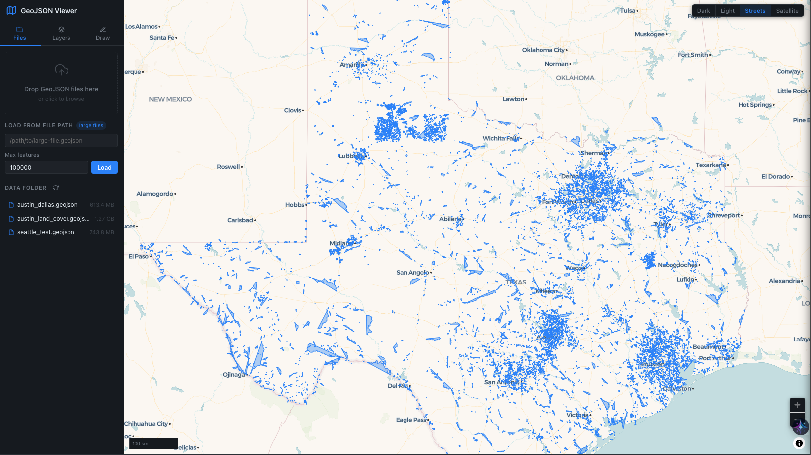

# GeoJSON Viewer

A fast, local GeoJSON visualizer for files of any size. Combines a WebGL-powered browser UI with a Python streaming backend so even multi-gigabyte files load in seconds.



---

## Features

| | |
|---|---|
| **WebGL rendering** | MapLibre GL JS renders millions of features smoothly |
| **Drag & drop** | Drop `.geojson` / `.json` files straight onto the page |
| **Multiple layers** | Load as many files as you like, each as its own layer |
| **Per-layer styling** | Toggle visibility, pick any color per layer |
| **Feature inspector** | Click any feature to see all its properties |
| **Hover tooltips** | Key property shown on hover without clicking |
| **Basemap switcher** | Dark, Light, Streets, Satellite — switch live |
| **Draw tools** | Draw points, lines, and polygons; export as GeoJSON |
| **Large file support** | Server-side streaming + random sampling via `ijson` |
| **Data folder** | Drop files in `data/` and load them from the sidebar |
| **Zoom to layer / all** | One-click fit bounds |
| **Status bar** | Live coordinates, zoom level, feature count |

---

## Quick start

### Option A — Browser only (small/medium files, no install needed)

```bash
# Download MapLibre locally (one-time, ~900 KB)
curl -sL https://unpkg.com/maplibre-gl@4.7.1/dist/maplibre-gl.css -o static/maplibre-gl.css
curl -sL https://unpkg.com/maplibre-gl@4.7.1/dist/maplibre-gl.js  -o static/maplibre-gl.js

# Serve from the repo root with Python's built-in server
python3 -m http.server 8000
```

Then open **http://localhost:8000** and drag GeoJSON files onto the page.

Works well for files up to ~150 MB. Larger files will be slow to parse in the browser.

---

### Option B — Full server (recommended for large files)

```bash
# Create and activate the virtual environment (one-time setup)
python3 -m venv .venv
source .venv/bin/activate        # Windows: .venv\Scripts\activate

# Install dependencies
pip install -r requirements.txt

# Download MapLibre locally (one-time, ~900 KB)
curl -sL https://unpkg.com/maplibre-gl@4.7.1/dist/maplibre-gl.css -o static/maplibre-gl.css
curl -sL https://unpkg.com/maplibre-gl@4.7.1/dist/maplibre-gl.js  -o static/maplibre-gl.js

# Start the server (opens browser automatically)
python server.py
```

Open **http://localhost:8000**, then use **"Load from path"** in the sidebar and paste the full path to your large file. The server streams and samples it server-side before sending it to the browser.

```bash
python server.py 9000      # custom port
```

---

## Using the app

### Loading files

| Method | How |
|--------|-----|
| **Drag & drop** | Drag one or more `.geojson` files onto the sidebar dropzone or the map |
| **File picker** | Click the dropzone area |
| **File path** | Paste a full path into the "Load from path" box and press **Load** |
| **Data folder** | Copy files into `data/` and click them in the sidebar |

### Layer panel

- **Color swatch** — click to change the layer's color
- **Eye icon** — toggle layer visibility
- **Magnifier** — zoom to fit the layer
- **×** — remove the layer
- Top toolbar: **zoom to all layers** / **remove all**

### Draw tools

Select a draw mode from the **Draw** tab:

| Tool | Usage |
|------|-------|
| **Select** | Default; click features to inspect |
| **Point** | Click anywhere to place a point |
| **Line** | Click to add vertices, **double-click** to finish |
| **Polygon** | Click to add vertices, **double-click** to close |

Right-click cancels the current drawing.
Use **Undo last** to remove the last vertex or the last completed feature.
**Export as GeoJSON** downloads all drawn features as `drawn-features.geojson`.
**Add as layer** converts drawn features into a regular layer.

### Basemap

Use the switcher in the top-right corner of the map:
- **Dark** — CARTO Dark Matter (default)
- **Light** — CARTO Positron
- **Streets** — CARTO Voyager
- **Satellite** — Esri World Imagery (no API key required)

---

## Large file tips

For 1 GB+ files, use the **server path loader**:

1. Start `python server.py`
2. Paste your file path into **"Load from path"**
3. Set **Max features** (default 100 000) — the server samples this many features uniformly across the file
4. Click **Load**

Install `ijson` for a 3–5× speed improvement on the counting pass:

```bash
pip install ijson
```

Without `ijson`, the server falls back to `json.load()` which loads the whole file into RAM first.

---

## CLI viewer (static image)

The original Python CLI tool is still available for generating PNG snapshots:

```bash
pip install ijson matplotlib shapely contextily tqdm

python src/geojson_viewer.py parcels.geojson
python src/geojson_viewer.py roads.geojson --max 200000 --color tomato
python src/geojson_viewer.py big.geojson --out preview.png --no-basemap
```

See `python src/geojson_viewer.py --help` for all options.

---

## Project structure

```
geojson-visualizer/
├── index.html          # Web app entry point
├── server.py           # Local HTTP server + streaming API
├── static/
│   ├── style.css       # Dark-theme UI styles
│   └── app.js          # MapLibre GL JS application
├── src/
│   └── geojson_viewer.py  # CLI static-image renderer
└── data/               # Drop GeoJSON files here for quick access
```

---

## Dependencies

### Web app (no install — served via CDN)
- [MapLibre GL JS](https://maplibre.org/) v4 — WebGL map rendering
- [CARTO Basemap Styles](https://carto.com/basemaps) — free, no API key

### Server
- Python 3.8+
- `ijson` *(optional but recommended)* — `pip install ijson`

### CLI viewer
- `ijson`, `matplotlib`, `shapely`, `contextily` *(optional)*, `tqdm` *(optional)*

---

## License

MIT
